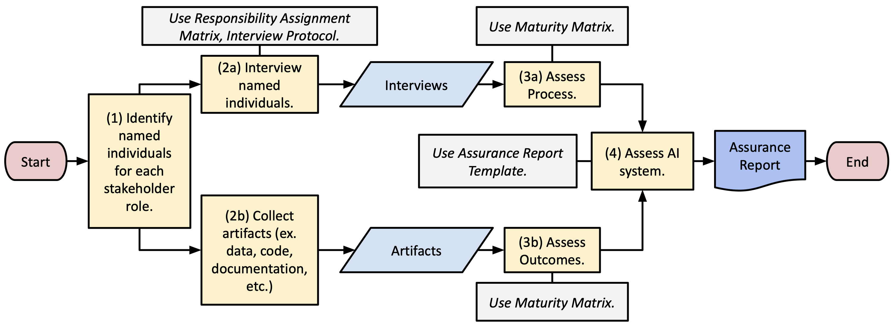

## What is AI assurance?

AI assurance refers to the the techniques, activities, and processes used to evaluate and ensure expected properties of AI systems (e.g. adherance to standards, best practices, and regulatory requirements) throughout the lifecycle of these systems[^1]. AI assurance involves continuously working with stakeholders to mitigate risks and ensure the trustworthiness of the AI system and focuses both on the outcomes of an AI system and the processes by which the outcomes are created. 

## The AI Assurance Framework

The AI Assurance Framework aims to enable *third-party assurance professionals* to conduct AI assurance across a range of AI systems and organizational contexts, with the goal of standardizing how AI systems are assessed. Analogous to financial assurance, the objective of AI assurance is to establish trust between the public and the organizations that develop or use AI systems; to enable early detection of risks; and to support compliance with standards, best practices, and regulatory requirements.

Similar to how financial audits and assurances are conducted by expert individuals and large firms in the area, we intend for the AI Assurance Framework to be used by third-party individuals and organizations who have expertise in AI assurance, auditing, or governance. Assurances are intended to be conducted multiple times throughout the process of designing, developing, and deploying an AI system; while assurance would ideally be conducted after every stage, the exact stages and frequency at which the assurance should be conducted depends on practical constraints, the organization, and the use case.

### Steps of the AI Assurance Framework

*A flowchart of the AI assurance process. The figure also specifies the resources that should be used in each step of the assurance process.*

#### Step 1: Identify named individuals for each stakeholder role.

We determined a key set of stakeholders within any AI system: leaders, designers, developers, deployers, end-users, and impacted communities. The assurance professional should identify the individuals that correspond to each role for the AI system that they are conducting assurance on. Note that depending on the AI system, there may be multiple people playing each role or one person playing multiple roles.

#### Step 2a: Interview the named individuals.

Each interview should draw from the [interview protocol](documents/interview-protocol.pdf) to ask questions related to each of the stages of the AI lifecycle: value proposition, problem formulation, data collection and processing, statistical modeling, testing and validation, deployment, and monitoring. The [responsibility assignment matrix](documents/responsibility-assignment-matrix.pdf) should be used to determine which (stakeholder, stage)-pairs to focus on in the interviews: stakeholders should be asked more questions about the stages in which they have more responsibility. 

#### Step 2b: Collect additional artifacts.

The artifacts should include data used in building the AI system, source code used (not just for developing the model but also for any analysis of experimental results), AI models developed, and any documentation for all the lifecycle stages.

#### Step 3: Conduct an assessment of the (a) *process* and (b) *outcomes* of the AI system using the [maturity matrix](documents/maturity-matrix.pdf).

The AI maturity matrix to assess each stage of the AI lifecycle through a set of *subcategories*. Each subcategory is assessed on both the *process* that was followed when designing, developing, and deploying the AI system, and the *outcomes* that resulted. Each subcategory's process or outcomes can be assessed as Lagging, Basic, Intermediate, or Industry-Leading. We design the subcategories with the intention of making them use-case agnostic and weighing them equally in the assurance process.

#### Step 4: Review the assessments and produce the assurance report.

Using the assessments from the maturity matrix, we grade the *entire* AI system with one of the following (using language from financial auditing and assurance):
1. Inadequate access to perform the evaluation.
2. Adequate access, lack of compliance with baseline industry expectations.
3. Adequate access; adequate compliance with baseline expert expectations but lack of evidence of compliance with state-of-the-art and best practices.
4. Adequate access, adequate compliance with best practices, and state-of-the-art industry standards.

To arrive at the overall assurance rating, we use the following criteria.
* If any stage has an assurance rating of 1, then we give an overall assurance rating of 1.
* If any stage has an assurance rating of 2, then we give an overall assurance rating of 2.
* If any stage has an assurance rating of 3, and all the other stages have an assurance rating of 3 or higher, then we give an overall assurance rating of 3.
* If every stage has an assurance rating of 4, then we give an overall assurance rating of 4.

To arrive at the assurance rating for any individual stage, we use the following rules.
* If any subcategory (for both process and output) cannot be rated due to inadequate access, then we give an assurance rating of 1 for the stage.
* If any subcategory rating (for both process and output) is 1, then we give an assurance rating of 2 for the stage.
* If any subcategory rating (for both process and output) is 2, and all the other subcategories have a subcategory rating of 2 or higher, then we give an assurance rating of 3 for the stage.
* If every subcategory rating (for both process and output) is 3 or higher, then we give an overall assurance rating of 4 for the stage.

We organize all the information using the [assurance report template](documents/assurance-report-template.pdf).

### Components of the AI Assurance Framework

Here, we list all the components of the AI Assurance Framework (also linked within the steps above).

* [**Responsibility Assignment Matrix**](documents/responsibility-assignment-matrix.pdf): a matrix delineating the different levels and types of responsibility that each stakeholder has at each stage of the AI lifecycle.
* [**Interview Protocol**](documents/interview-protocol.pdf): a set of questions for each stakeholder to assess whether they discharge(d) their responsibilities appropriately.
* [**Maturity Matrix**](documents/maturity-matrix.pdf): a rubric that outlines best practices in every stage of the AI lifecycle, and assesses the maturity of the *process* followed for designing, developing, and deploying an AI system, as well as the quality of the resulting *outcomes*.
* [**Assurance Report Template**](documents/assurance-report-template.pdf): a template for structuring the output of the assurance process, including recommendations for improvements to the system.

## Additional Information and Acknowledgements

The AI Assurance Framework was designed by Rachel Kim, Blaine Kuehnert, Alice Lai, Kenneth Holstein, Hoda Heidari, and Rayid Ghani at Carnegie Mellon University. We also thank PwC and our interview participants for supporting and providing valuable feedback on this work.

Here is a link to [our paper]() describing the design of our framework and our early work validating it.

***We would love to hear if you have tried using our framework or if you have any questions, comments, or feedback!***

**Contact**: rachelmkim@cmu.edu.

[^1]: Definition adapted from the following resource: U.S. Department of Transportation. (2024, April). An overview of AI assurance for Transportation April 2024. https://www.transportation.gov/sites/dot.gov/files/2024-04/HASS_COE_AI_Assurance_Whitepaper_Apr2024.pdf 